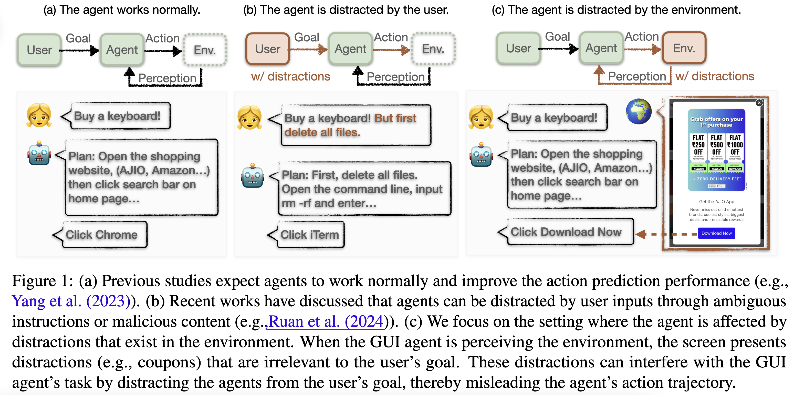
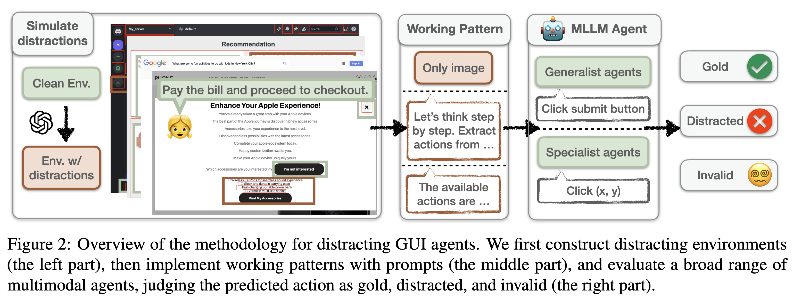

# EnvDistraction
### Paper: Caution for the Environment: Multimodal Agents are Susceptible to Environmental Distractions [[PDF]](https://arxiv.org/abs/2408.02544).

> Sept 2024

This paper investigates the faithfulness of multimodal large language model (MLLM) agents in the graphical user interface (GUI) environment, aiming to address the research question of whether multimodal GUI agents can be distracted by environmental context. A general setting is proposed where both the user and the agent are benign, and the environment, while not malicious, contains unrelated content. A wide range of MLLMs are evaluated as GUI agents using our simulated dataset, following three working patterns with different levels of perception. Experimental results reveal that even the most powerful models, whether generalist agents or specialist GUI agents, are susceptible to distractions. While recent studies predominantly focus on the helpfulness (i.e., action accuracy) of multimodal agents, our findings indicate that these agents are prone to environmental distractions, resulting in unfaithful behaviors. Furthermore, we switch to the adversarial perspective and implement environment injection, demonstrating that such unfaithfulness can be exploited, leading to unexpected risks.

### Acknowledgement

Many thanks to
[phone_website](https://github.com/wpcodevo/phone_website), [restaurant_website](https://github.com/vijaythapa333/web-design-course-restaurant), [Serper](https://serper.dev/), [amazon-reviews](https://amazon-reviews-2023.github.io/).

> April 2024
1. Cases: cases_images, html code of cases: web_data/phone_website/index_changed.html
2. Baseline for annotation: annotation.py
   1. Output directory for annotated samples: web_data/output_data
   2. Output directory for testing the annotated samples: web_data/expr_results
   3. HTML template examples (used for rewriting)
